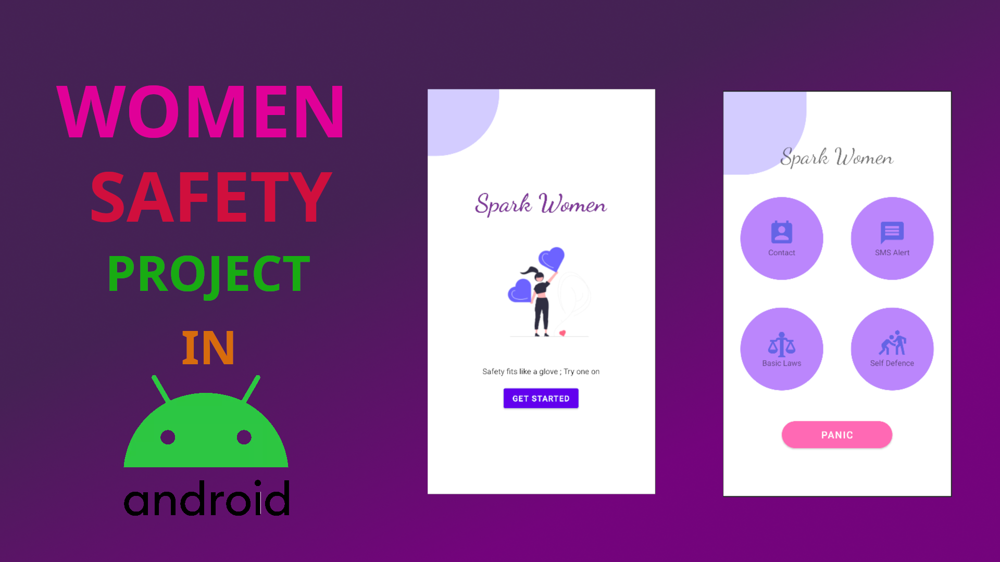

# ⚡ Spark Women - A Women Safety Application
## _Feel Safe Everywhere_


Women Safety App is user friendly application built in Android Studio,
it is simple to implement,easy to understand.

Demo Download App : [Click Here](https://drive.google.com/file/d/1TJXf78jdOApBczgf488w1L5r7Oj3FhYY/view?usp=share_link)

[]


## Features

- Easy to implement
- Easy to understand
- Shake detector
- Siren sound
- Call to registered mobile
- Shake device to send SOS to registered mobile and play siren
- Sends Last Known Location to registered mobile
- Now we can add multiple contacts to send SOS

#### Prerequisites :
- Android Studio
- Basic knowledge about Firebase Authentication and Realtime database.
## Build and Run Application

###### SparkWomen A Women Safety Application requires Android Oreo or newer version to run.
Follow this steps to get Working Project!
```
Clone this repository or download file
Extract zip if downloaded code
Open project in Android Studio
Wait while Android Studio Download gradle or required files
Hit Run Button !
```

------------
